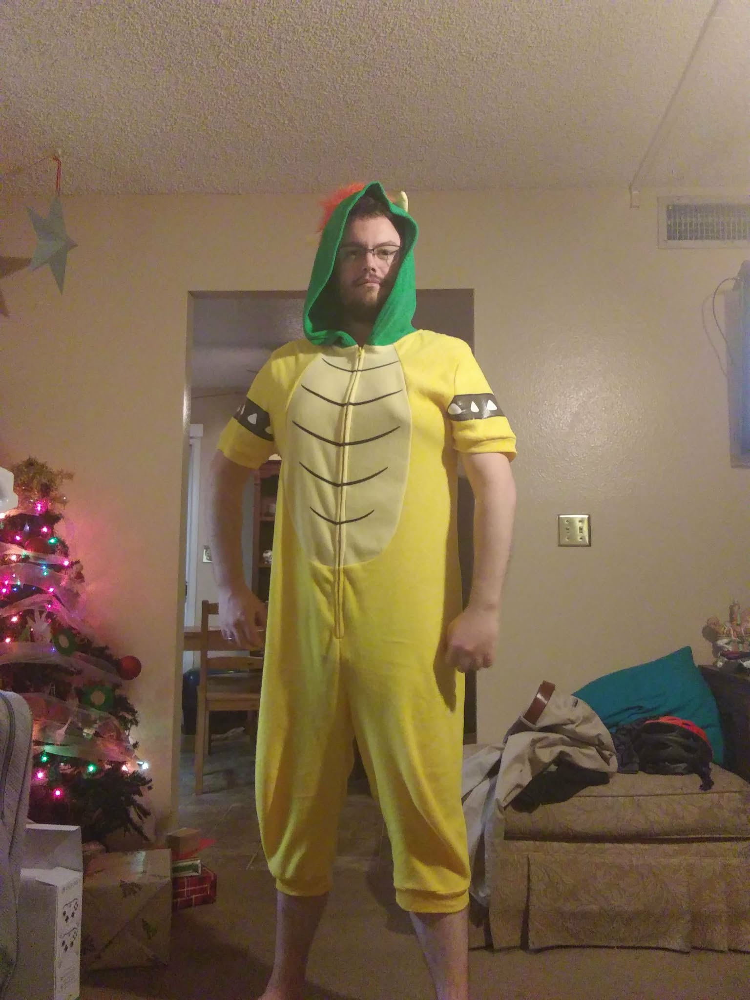

# Restore Instructions for Removed Image Elements

## 1. About Section Photo

To restore the author photo in the About section, add this div back inside `.about-content` (before `.about-text`):

```html
<div class="about-photo">
    
</div>
```

Location: Inside `<section id="about">` > `.container` > `.about-content`

---

## 2. Aspirational Author Visual Section

To restore the Bowser image section, add this entire section after the News section and before the Newsletter section:

```html
<section class="section feature-image">
    <div class="container">
        <h2>Aspirational Author Visual</h2>
        
    </div>
</section>
```

Location: Between `<section id="news">` and `<section id="newsletter">`

---

## Image Files

Both image files are still in the repository:
- `jason-padeca.jpg` - Portrait photo (columns/suit)
- `jason-padeca-bowser.jpg` - Bowser onesie photo
